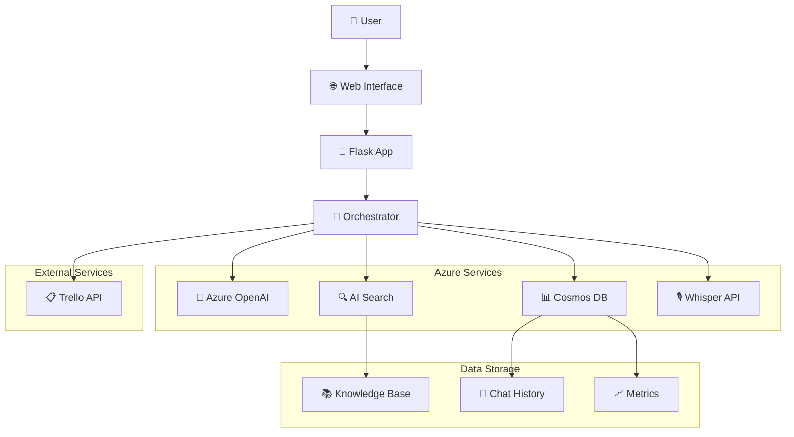
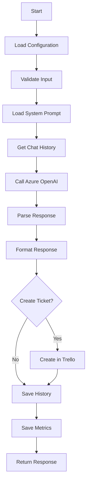
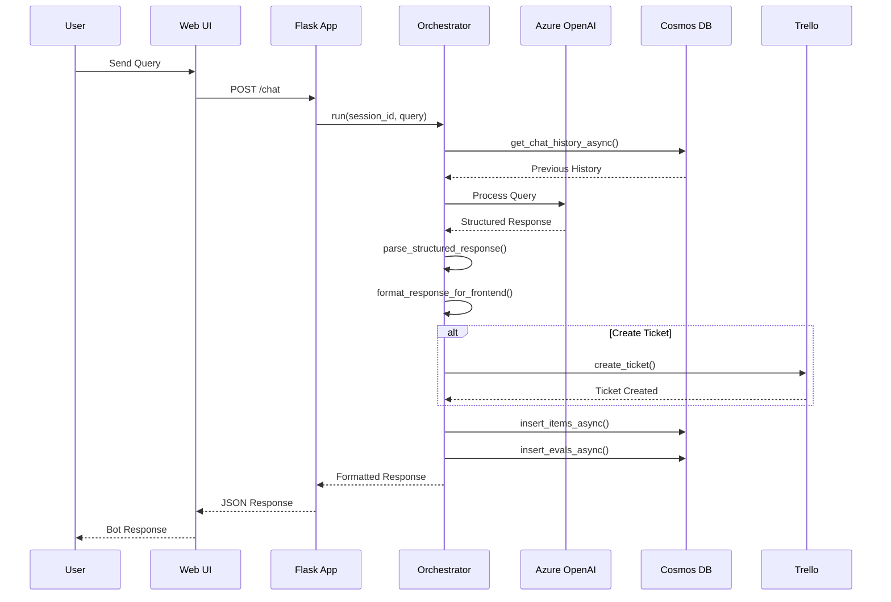
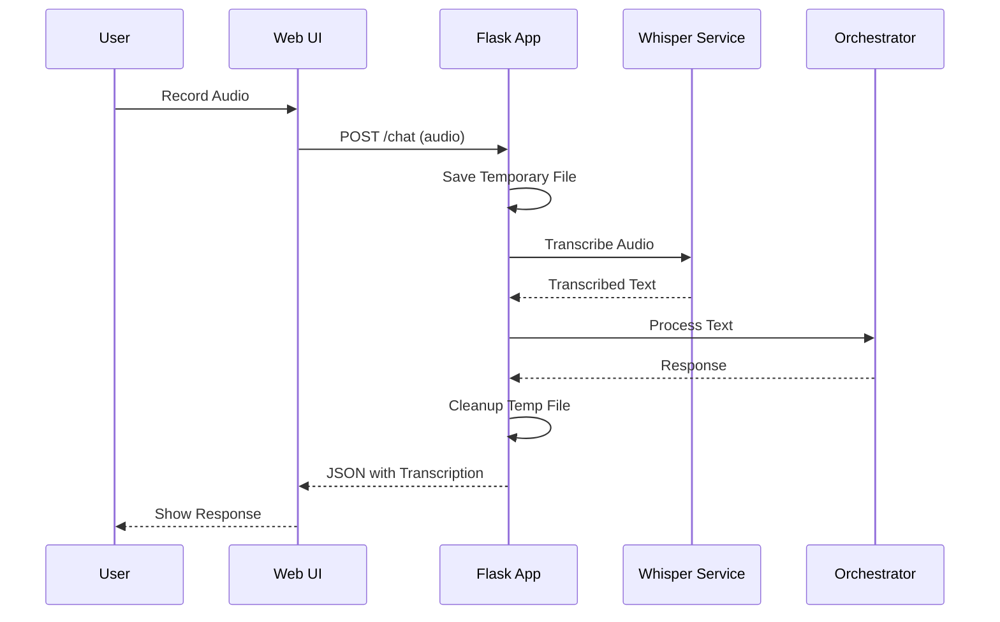
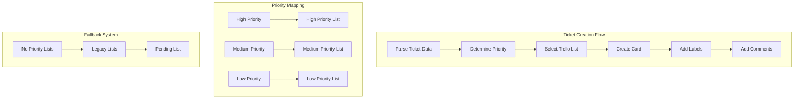
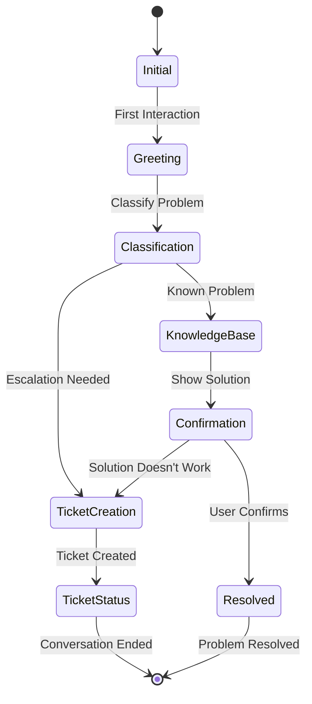
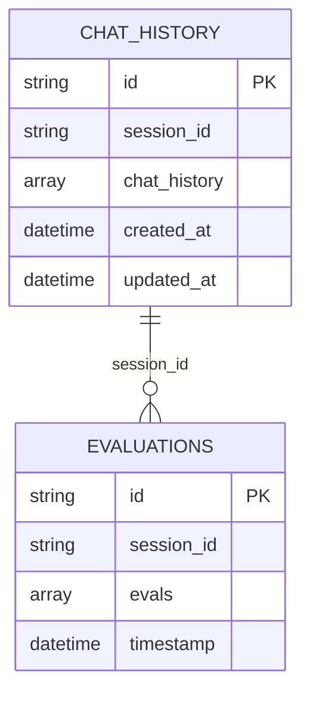

# System Architecture - Generic IT Support AI Assistant

## Table of Contents

1. [Executive Summary](#executive-summary)
2. [Overall Architecture](#overall-architecture)
3. [System Components](#system-components)
4. [Data Flow](#data-flow)
5. [External Service Integration](#external-service-integration)
6. [State Management](#state-management)
7. [Data Architecture](#data-architecture)
8. [Security](#security)
9. [Scalability Considerations](#scalability-considerations)
10. [Design Patterns](#design-patterns)
11. [Configuration System](#configuration-system)

## Executive Summary

The Generic IT Support AI Assistant is designed as a modular and scalable solution that provides automated first-line technical support for organizations. The architecture follows microservices principles, separation of concerns, and asynchronous operations to ensure high performance and maintainability.

## Overall Architecture

### High-Level Architecture Diagram



### Layered Architecture

The system is organized into the following layers:

1. **Presentation Layer**: Responsive web interface with HTML/CSS/JavaScript
2. **Application Layer**: Flask framework with routing and session management
3. **Orchestration Layer**: Central business logic and service coordination
4. **Service Layer**: Clients for external service integration
5. **Data Layer**: Persistent and temporary storage

## System Components

### 1. Flask Application (`app.py`)

**Class**: N/A (Module-level functions)

**Key Methods**:
- `chat()`: Main endpoint handler for `/chat` route
- `handle_text_request()`: Processes text-based requests
- `handle_audio_request()`: Processes audio requests with Whisper integration
- `start_app()`: Application startup function

**Responsibilities**:
- HTTP request/response handling
- Session management using Flask sessions
- Audio file processing and cleanup
- Input validation and error handling
- Integration with Orchestrator for business logic

**Technical Details**:
```python
# Session management
session_id = data.get('sessionID') or session.get('sessionID')
if not session_id:
    session_id = str(uuid.uuid4())
    session['session_id'] = session_id

# Audio processing with temporary file handling
temp_dir = tempfile.mkdtemp()
audio_path = os.path.join(temp_dir, 'temp_audio.wav')
```

### 2. Orchestrator (`orchestrator.py`)

**Class**: `Orchestrator`

**Key Methods**:
- `run(session_id, query)`: Main processing pipeline
- `parse_structured_response(response_data)`: Parses AI model responses
- `format_response_for_frontend(structured_response)`: Formats responses for UI
- `read_file(file_path, as_json=False)`: Utility for file reading

**Responsibilities**:
- Service coordination and workflow management
- Response parsing and formatting
- Cost calculation and metrics tracking
- Configuration management

**Technical Implementation**:
```python
class Orchestrator:
    def __init__(self):
        config = Config().config
        self.azurecosmos = AzureCosmosDBClient()
        self.gpt4o_name = config["model"]["deployments"]["gpt-4o"]["name"]
        self.gpt4o_input_price = config["model"]["deployments"]["gpt-4o"]["price"]["input_tokens"]
        # ... additional configuration loading
```

**Response Processing Flow**:


### 3. Service Layer (`services/`)

#### Azure OpenAI Client (`azopenai.py`)

**Class**: `AzureOpenAIClient`

**Key Methods**:
- `run(model, system_prompt, message, messages_history, functions, function_call)`: Main execution method
- `openai_response(client, model, messages, functions, function_call)`: OpenAI API interaction
- `parse_content(response_content)`: Content parsing and JSON extraction
- `load_env_var()`: Environment variable loading
- `create_openai_client(env_vars)`: Client instantiation

**Configuration Support**:
```python
# Supports multiple response formats
if self.response_format == "function_calling":
    completion_params.update({"functions": functions, "function_call": function_call})
    completion = client.chat.completions.create(**completion_params)
```

#### Cosmos DB Client (`cosmosdb.py`)

**Class**: `AzureCosmosDBClient`

**Key Methods**:
- `get_chat_history_async(session_id)`: Retrieve conversation history
- `insert_items_async(container, session_id, items, field)`: Insert chat data
- `insert_evals_async(session_id, evals_data)`: Insert evaluation metrics
- `load_env_var()`: Environment variable loading
- `create_cosmos_client(env_vars)`: Client creation

**Asynchronous Operations**:
```python
async def get_chat_history_async(self, session_id):
    try:
        item = await asyncio.to_thread(self.container_history.read_item, 
                                     item=session_id, partition_key=session_id)
        return item.get('chat_history', [])
    except exceptions.CosmosResourceNotFoundError:
        return []
```

#### Trello Client (`ticket_trello.py`)

**Class**: `TrelloTicketClient`

**Key Methods**:
- `create_ticket(ticket_data)`: Create new tickets with priority mapping
- `update_ticket(trello_card_id, update_data)`: Update existing tickets
- `_get_list_id_by_priority(priority, env_vars)`: Priority-based list mapping
- `_add_labels_to_card(card_id, ticket_data, env_vars)`: Label management

**Flexible Configuration System**:
```python
def _get_list_id_by_priority(self, priority, env_vars):
    # Priority-based mapping (new system)
    priority_list_mapping = {
        'alta': env_vars.get("TRELLO_LIST_HIGH_PRIORITY_ID"),
        'media': env_vars.get("TRELLO_LIST_MEDIUM_PRIORITY_ID"),
        'baja': env_vars.get("TRELLO_LIST_LOW_PRIORITY_ID")
    }
    
    # Fallback to legacy system if new lists aren't configured
    if not list_id:
        legacy_fallbacks = {
            'alta': env_vars.get("TRELLO_LIST_IN_PROGRESS_ID"),
            'media': env_vars.get("TRELLO_LIST_PENDING_ID"),
            'baja': env_vars.get("TRELLO_LIST_COMPLETED_ID")
        }
```

#### AI Search Client (`aisearch.py`)

**Class**: `AzureAISearchClient`

**Key Methods**:
- `run(query)`: Execute search queries
- `search(client, query, env_vars)`: Perform semantic/hybrid search
- `create_search_client(env_vars)`: Client instantiation

**Search Configuration**:
```python
# Supports multiple search types
if self.search_type == "hybrid_semantic":
    search_kwargs.update({
        "search_text": query,
        "query_type": QueryType.SEMANTIC,
        "semantic_configuration_name": env_vars["SEMANTIC_CONFIGURATION_NAME"]
    })
```

#### Whisper Client (`whisper.py`)

**Class**: `WhisperClient`

**Key Methods**:
- `run(audio_path, operation_type)`: Audio transcription
- `create_openai_client(env_vars)`: Client creation

**Audio Processing**:
```python
response = client.audio.transcriptions.create(
    file=audio,
    model=self.whisper,
    language="es",
    prompt="Este es un audio en español de un usuario solicitando ayuda técnica de TI."
)
```

## Data Flow

### Main Conversation Flow



### Audio Processing Flow



## External Service Integration

### Azure OpenAI Integration

The system integrates with Azure OpenAI using function calling:

```python
# Function calling configuration
functions = self.read_file(os.path.join(self.functions_path, self.functions), as_json=True)
function_call = self.function_call

result = azurezopenai.run(
    model_gpt4o, 
    system_prompt, 
    message_user, 
    messages_history, 
    functions=functions, 
    function_call=function_call
)
```

### Trello Integration



## State Management

### Conversation States



### Response Types

The system supports multiple response formats:

```python
def parse_structured_response(self, response_data):
    structured_response = {
        "flag_kb": parsed_data.get("flag_kb", False),
        "flag_options": parsed_data.get("flag_options", False),
        "flag_ticket": parsed_data.get("flag_ticket", False),
        "answer": parsed_data.get("answer", ""),
        "options": parsed_data.get("options", []),
        "ticket_summary": parsed_data.get("ticket_summary")
    }
```

## Data Architecture

### Cosmos DB Data Model



### Response Structure

```json
{
  "flag_kb": false,
  "flag_options": true,
  "flag_ticket": false,
  "answer": "Assistant response",
  "options": ["Option 1", "Option 2"],
  "ticket_summary": {
    "ticket_id": "HD123456",
    "issue_type": "PASSWORD_RESET",
    "priority": "Medium",
    "status": "Open",
    "user_name": "User Name",
    "asset_tag": "LT-00987"
  }
}
```

## Security

### Security Measures

1. **Authentication & Authorization**
   - Flask session management
   - Environment variable protection
   - API key security

2. **Data Protection**
   - HTTPS communication
   - Input sanitization
   - Secure file handling

3. **Error Handling**
   - Graceful failure handling
   - Logging without sensitive data exposure
   - Resource limits and timeouts

```python
# Secure environment variable loading
@staticmethod
def load_env_var():
    required_vars = [
        "AZURE_OPENAI_ENDPOINT",
        "AZURE_OPENAI_API_KEY",
        "AZURE_OPENAI_API_VERSION"
    ]
    env_vars = {var: os.getenv(var) for var in required_vars}
    missing_vars = [var for var, value in env_vars.items() if not value]
    if missing_vars:
        raise ValueError(f"Missing environment variables: {', '.join(missing_vars)}")
```

## Scalability Considerations

### Scaling Strategies

1. **Horizontal Scaling**
   - Multiple Flask instances
   - Load balancing
   - Data partitioning

2. **Performance Optimization**
   - Asynchronous operations
   - Response caching
   - Connection pooling

3. **Monitoring & Metrics**
   - Token cost tracking
   - Performance metrics
   - System health alerts

```python
# Asynchronous operations for better performance
async def run(self, session_id, query):
    messages_history = await self.azurecosmos.get_chat_history_async(session_id)
    # ... processing logic
    await self.azurecosmos.insert_items_async(self.azurecosmos.container_history, session_id, new_messages, "chat_history")
```

## Design Patterns

### Implemented Patterns

1. **Facade Pattern**: Orchestrator as facade for services
2. **Strategy Pattern**: Different response strategies based on flags
3. **Factory Pattern**: Service client creation
4. **Observer Pattern**: Logging and metrics
5. **Command Pattern**: Asynchronous operations

### Architecture Benefits

- **Modularity**: Independent and interchangeable components
- **Testability**: Easy unit and integration testing
- **Maintainability**: Clean and well-structured code
- **Scalability**: Prepared for growth
- **Flexibility**: Easy addition of new features

## Configuration System

### Configuration Architecture

The system uses a flexible configuration approach that prioritizes environment variables while providing JSON-based defaults:

```python
class Config:
    def __init__(self, config_path="config/config.json"):
        self.config_path = config_path
        self.config = self.load_config()
    
    def load_config(self):
        try:
            with open(self.config_path) as file:
                config = json.load(file)
            return config
        except FileNotFoundError:
            logger.error(f"Configuration file not found at {self.config_path}")
            return {}
```

### Configuration Flexibility

#### Environment Variable Priority
Environment variables always take precedence over config file values:

```python
# Service clients check environment first
env_vars = {var: os.getenv(var) for var in required_vars}
```

#### Multi-Level Fallbacks
The Trello integration demonstrates the flexible configuration approach:

```python
# Priority-based lists (preferred)
TRELLO_LIST_HIGH_PRIORITY_ID=high_priority_list_id

# Legacy fallback system
TRELLO_LIST_PENDING_ID=pending_list_id
TRELLO_LIST_IN_PROGRESS_ID=in_progress_list_id
```

#### Modular Configuration
Each service has its own configuration section:

```json
{
  "model": {
    "deployments": {
      "gpt-4o": {
        "name": "gpt-4o",
        "price": {
          "input_tokens": 0.0000025,
          "output_tokens": 0.00001
        }
      }
    }
  },
  "ai_search": {
    "search_type": "hybrid_semantic",
    "k_nearest_neighbors": 5
  },
  "trello": {
    "priority_labels": {
      "alta": "LABEL_ID_HIGH_PRIORITY",
      "media": "LABEL_ID_MEDIUM_PRIORITY"
    }
  }
}
```

### Configuration Benefits

1. **Deployment Flexibility**: Easy environment-specific configurations
2. **Security**: Sensitive data in environment variables
3. **Maintainability**: Clear separation of concerns
4. **Extensibility**: Easy addition of new configuration options
5. **Backward Compatibility**: Fallback mechanisms for smooth transitions

---

**Generic IT Support AI Assistant - System Architecture**  
*Version 1.0 - Designed for flexible IT support automation* 